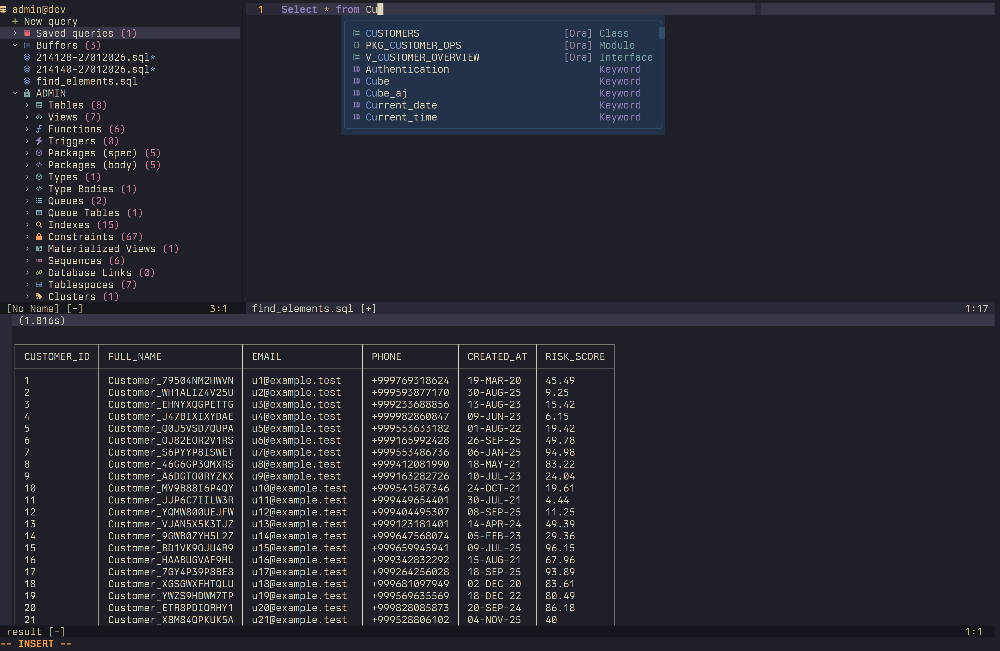

# oravim

Oracle-only Neovim plugin that runs SQL through `sqlplus`, has a builtin schema aware completion engine, shows results in a split, and browses the current schema from a lightweight drawer.

## Features
- Drawer UI for schema, objects, buffers e.t.c
- Omnifunc/blink.cmp completion for tables, views, columns, packages, functions and members 
- View function/procedure/type specs and bodies from the drawer
- Run full buffer or visual selection
- Query templates for new buffers and table-centric queries
- Saved query files with rename/delete from the drawer

## Developer Notes
You can also use Oravim just for PL/SQL or query development without the UI: connect with `:OraConnect`, close the drawer, and keep the buffer open to use omnifunc or blink.cmp completions.

You may also want the companion blink.cmp source for PL/SQL keyword completion: https://github.com/pompos02/blink-cmp-plsql.nvim
## UI



Video showcasing completions, querying and general workflow: [oravimdemo1.mp4](media/oravimdemo1.mp4)

## Requirements
- Neovim 0.10+ 
- Oracle `sqlplus` available on your PATH
- Oracle `sqlcl` available on your PATH for pretty output (`pretty_result`)

## Installation

### lazy.nvim
```lua
{
    "popmpos02/oravim",
    config = function()
        require("oravim").setup({
            -- optional configuration (see below)
        })
    end,
}
```

### packer.nvim
```lua
use({
    "popmpos02/oravim",
    config = function()
        require("oravim").setup({
            -- optional configuration (see below)
        })
    end,
})
```

## Quick start
1. Start Neovim, then connect:

```vim
:OraConnect user/password@host
```

2. Toggle the drawer:

```vim
:OraToggle
```

3. Open a query buffer from the drawer, write SQL, then run:

```vim
<F8>
```

4. To run only a visual selection:

```vim
<F8> (in visual mode)
```

## Usage

### Commands
- `:OraConnect {sqlplus-connection-string}`: connect to Oracle (example: `user/password@host`)
- `:OraToggle`: open/close the drawer with schema objects and saved queries
- `:OraSave`: save the current query buffer into your saved queries list

### Default keymaps
These are defined by the plugin and can be overridden in your config.

- **Normal mode:** `<F8>` runs the current buffer
- **Visual mode:** `<F8>` runs the selection
- **Normal mode:** `<space>pp` runs with pretty output `[EXPERIMENTAL]` ⚠️
- **Visual mode:** `<space>pp` runs the selection with pretty output `[EXPERIMENTAL]` ⚠️

To override them, delete the defaults and set your own after the plugin loads:

```lua
vim.keymap.del("n", "<F8>")
vim.keymap.del("v", "<F8>")
vim.keymap.del("n", "<space>pp")
vim.keymap.del("v", "<space>pp")

vim.keymap.set("n", "<leader>or", function()
    require("oravim").run()
end, { desc = "Oravim: run" })

vim.keymap.set("v", "<leader>or", function()
    require("oravim").run({ selection = true })
end, { desc = "Oravim: run selection" })

vim.keymap.set("n", "<leader>op", function()
    require("oravim").run({ pretty_result = true })
end, { desc = "Oravim: run (pretty)" })

vim.keymap.set("v", "<leader>op", function()
    require("oravim").run({ selection = true, pretty_result = true })
end, { desc = "Oravim: run selection (pretty)" })
```

### Drawer controls
- `<CR>` / `o`: open or toggle the focused item
- `q`: close the drawer
- `d`: delete selected buffer or saved query
- `R`: rename a saved query
- `<leader>C`: collapse all schema sections
- `<leader>E`: expand all schema sections

## Completion
Oravim sets `omnifunc` for the configured `query.filetype`.


### Native omnifunc
```lua
vim.bo.omnifunc = "v:lua.require'oravim.completion'.omnifunc"
```

### blink.cmp source
```lua
require("blink.cmp").setup({
    sources = {

        per_filetype = {
            sql = { "oravim", "buffer"},
            plsql = { "oravim", "buffer"},

            providers = {
                oravim = {
                    name = "oravim",
                    module = "oravim.blink",
                },
            },
        },
    }
})
```

## Configuration

```lua
require("oravim").setup({
    cli = "sqlplus",
    drawer = {
        width = 40,
        position = "left", -- "left" or "right"
    },
    use_nerd_fonts = true,
    max_completion_items = 5000,
    query = {
        filetype = "plsql",
        default = "SELECT * FROM {optional_schema}{table};",
        new_query = "",
        execute_on_save = false,
        tmp_dir = "/tmp/oravim",
        saved_dir = vim.fn.stdpath("data") .. "/oravim/saved_queries",
    },
    results = {
        pinned_header = true,
    }
})
```
## Data locations
- Temporary query buffers: `query.tmp_dir` (default: `/tmp/oravim`)
- Saved queries: `query.saved_dir` (default: `stdpath('data')/oravim/saved_queries`)

## Behavior notes
- The plugin extracts the schema owner from the connection string (the username before `/`).
- Only the current schema owner is shown in the drawer.
- Pretty output is experimental and may truncate or format differently depending on the query.

## Troubleshooting
- `sqlplus not found on PATH`: install Oracle client tools or set `cli` to the full path.
- No completion items: connect first with `:OraConnect`, then open a buffer with the configured filetype.
